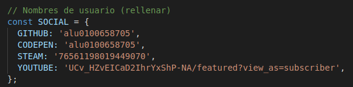
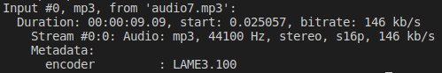
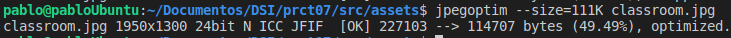

## Práctica 7: Optimización web

## Pablo Bethencourt Díaz

## alu0100658705@ull.edu.es

### FASE INICIAL

1. **Examina el código del fichero index.js y modifica las primeras líneas, en el objeto SOCIAL, con los nombres de usuario que utilizas en las redes diferentes sociales mencionadas.**

   Se han cambido los iconos (puesto que no utilizo redes sociales). Veamos las modificaciones realizadas:

   

   

   

2. **El alumno deberá crear un video para colocar al final de la sección Objetivo. Debe ser un video alojado en nuestros assets, utilizando la etiqueta HTML <video>. La duración del video debe estar entre 30-60 segundos.**

   Se ha subido un video grabado desde el móvil:

   

3. **El alumno deberá crear un audio para colocar después del video anterior, utilizando la etiqueta HTML <audio>. Puedes grabar el audio utilizando el micro y un programa como Audacity. Si lo prefieres y te resulta más sencillo, también puedes grabar el audio con el móvil.**

   Creación del audio con _Audacity_, se ha añadido también un audio adicional que contiene una canción:

   

4. **El alumno deberá crear cuatro imágenes y añadirlas a la galería de la sección Galería. Las dos primeras deberán ser fotografías (puedes tomarlas con una cámara o el móvil). Las dos últimas deberán ser capturas de pantalla del PC (por ejemplo, del VSCode o GitHub donde estés trabajando). Guardalas en un formato apropiado y añádelas a la web con un texto de pie de foto divertido. Recuerda que deberás modificar ligeramente el CSS de esa parte para que cambie el número de filas del grid.**

   Se han añadido las cuatro imágenes, y se ha modificado el grid.

   

5. **Edita el fichero markdown llamado REPORT.md, donde rellenarás una tabla comparativa con todos los archivos de la página que se descargan al cargarla en el navegador. Puedes apoyarte en Chrome Dev Tools (pestaña Network) para saber cuales son esos archivos. Recuerda rellenar los campos apropiados para cada fichero, investigando que formato tienen, que tamaño que ocupan, que codecs están utilizando (en el caso de los videos/audios), etc...**

   Vemos los valores iniciales a pie de ventana correspondientes al número de recursos de la página, el tamaño de todos los archivos, el tiempo de carga de los recursos y el tiempo total en procesar el DOM:

   

   Con el plugin de _bundle-visualiser_ se ha generado un fichero html con los tamaños de los archivos originales, se puede visitar desde la parte del _informe de optimización_ de la web.

### OPTIMIZACIÓN:

1. **Utiliza ffmpeg para intentar optimizar el tamaño del audio. En este caso mantén la duración original, pero busca un códec diferente con el que consigas un tamaño más reducido y una calidad aceptable.**

   Para obtener información específica del fichero de audio (o video) e identificar su códec se puede hacer uso del comando <code>ffprobe fichero.mp3</code> o de <code>ffmpeg -i fichero.mp3</code>:

   

   Ya que se dispone de dos audios, se hará uso originalmente de **flac** para la canción seleccioanada y **opus** para el audio grabado, y luego, en función de los resultados obtenidos, se descartarán los códecs menos óptimos y se hará la comparación entre ellos.

   Trás ejecutar <code>ffmpeg -i kudasai.mp3 -c:a flac kudasai_out.flac</code>, observamos que el tamaño del nuevo fichero de audio es mucho mayor (9.1MB vs 4.7MB), por lo que descartamos **flac** y empleamos **vorbis**; <code>ffmpeg -i input.mp3 -c:a libvorbis output.ogg</code>. En este caso obtenemos un tamaño mucho menor, de 2.1MB.

   Empleamos ahora <code>ffmpeg -i audio7.mp3 -c:a libopus audio7.opus</code> con el archivo _audio7.mp3_ que originalmente tenía un tamaño de 163KB, obteniendo un nuevo arhivo de 77KB.

   Cómo ambos archivos han reducido su tamaño a la mitad, y la calidad del audio parece conservarse en ambos casos, considero que ambos codecs son perfectamente válidos y óptimos si se busca ahorrar espacio.

2. **Utiliza ffmpeg para recortar el video y quedarte sólo con los 10-15 primeros segundos. Aprovecha y asignale el códec (audio/video) que consideres más apropiado de cara a la optimización. Refleja en el README por qué te has decantado por el codec elegido.**

   En primer lugar eliminamos el audio del video que se ha subido a la web con el comando <code> ffmpeg -i vid7.mp4 -an vid7_ns.mp4</code>.

   A continuación seleccionamos un nuevo códec para los videos:

   - Para el primer video, cuyo codec original es el **h264**, se ha decidido utilizar el códec **h265**, puesto que, trás un ejercicio de documentación, parece que este códec supone una mejora directa de su versión anterior, siendo, en teoría, capaz de comprimir el video con la misma calidad y ocupando la mitad de espacio. Ejecutamos <code>ffmpeg -i typing.mp4 -vcodec libx265 typing_nc.mp4</code>. Veamos el resultado:

   

   Como se puede observar, el video con el nuevo códec ocupa menos de una tercera parte que el orginal, y tras realizar la visualización del mismo, no se aprecia que haya perdido calidad.

   - Para el segundo video, el creado para la sección _Objetivo_, seleccionamos sólo los primeros 15 segundos, ejecutamos <code>ffmpeg -i vid7_ns.mp4 -ss 00:00 -to 00:15 vid7_out.mp4</code> obteniendo un tamaño de 10MB. Luego se hace uso del códec **VP9**, contemporaneo al códec **h265**. La elección no ha sido casual, puesto que nos permitirá apreciar las diferencias existentes entre ambos y determinar cual es más óptimo. Ejecutamos <code>ffmpeg -i vid7_out.mp4 -vcodec libvpx-vp9 vid7_final.mp4</code>

   

   Los resultados muestran una diferencia abismal, el tamaño obtenido trás pasar al nuevo códec es de tan solo 378KB, teniendo en cuanta que orginalmente ocupaba 10MB, se aprecia el enorme cambio producido. Por otra parte, cabe destacar que la pérdida de calidad es bastante notoria.

   Trás ver los resultados en ambos videos, no sabría cual de los códecs empleados considerar mejor, por un lado **h265** muestra una reducción del tamaño considerable, pero lejos del nivel de **VP9**, y por otro, **h265** conserva la misma calidad del video original, mientras que **VP9** hace que se vea bastante peor.

   Cabe destacar, que para el primer video, el resultado de la operación no era reproducible en la web, por lo que se ha tenido que ejecutar <code>ffmpeg -i typing_nc.mp4 -pix_fmt yuv420p typing_final.mp4</code>, obteniendo un tamaño de 12MB.

3. **Utiliza las herramientas de optimización o estrategias que consideres oportunas para optimizar el resto de recursos de la página (JPEG, PNG, SVG, HTML, CSS, etc...). Refleja en el informe las particularidades para cada tipo de archivo.**

- Optimización de los ficheros HTML, CSS y JS con la herramienta _htmlnano_:

  HTML: Se hace uso del siguiente fichero de configuración definido en las transparencias:

  

  Trás realizar _parcel build_ obtenemos un tamaño del fichero "index.html" de 6.4KB frente a los 6.8KB del fichero original.

  CSS: Añadimos las siguiente líneas al fichero anterior:

  

  El fichero index.css que originalmente ocupaba 4.1KB, pasa a tener un tamaño de 3.1KB.

  JS: Para optimizar los ficheros .js es necesario modificar el fichero _.htmlnanorc_ nuevamente:

  

  Se obtiene un tamaño del fichero _index.js_ trás la ejecución del "build" de 1.3MB.

- Optimización de imágnes:

  Para las imágenes en formato _PNG_ haremos uso de la herramienta **optiPNG**:

  

  Aquellas que tienen formato _SVG_ se optimizan con **SVGO**:

  

  Y finalmente, para las imágenes _jpeg_ utilizamos **jpegoptim**:

  

  Con aquellas imágenes que muestren un porcentaje de compresión bajo (<5%), probaremos a aplicarle un tamaño predefinido igual a la mitad de su tamaño actual:

  

  Para cada una de las imágenes se ha comprobado que no han perdido calidad o, si lo han hecho, ha sido en muy baja medida.

4. **Resultados finales**

   Trás las modificaciones realizadas, comprobamos desde _Dev Tools_ los nuevos valores de los recursos:

   Y generamos un nuevo fichero html con _bundle-visualiser_ accesible desde la web.

**Reto: Elige uno de los recursos (video, imagen, etc...) de tu página. Intenta optimizarlo con diferentes herramientas y formatos y haz una tabla comparativa para indicar cuál tiene los mejores resultados con ese archivo en cuestión.**

Defino una nueva tabla donde comparo diferentes herramientas y formatos sobre las imágenes en formaro _png_ que añadí a la web. Utilizo las herramientas **optiPNG** (con el mayor nivel de optimización), **PNGCrush** y **pngquant**:

Quien muestra mejores resultados es **pngquant**, comprimiendo las imágenes de manera más significativa y manteniendo la misma calidad que la original.
